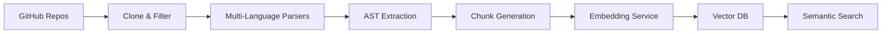

# Code Ingestion System

[](https://www.python.org/downloads/)
[](https://modal.com)
[](https://opensource.org/licenses/MIT)

**Multi-Language Vector Database Pipeline** - A comprehensive system for ingesting, parsing, and vectorizing code repositories into searchable vector databases.

## 🎯 What is This?

A production-ready code ingestion pipeline that:
- **Clones** GitHub repositories
- **Parses** multi-language codebases (Rust, TypeScript, Solidity, Documentation)
- **Embeds** code chunks using state-of-the-art embedding models
- **Stores** vectors in Qdrant or SurrealDB for semantic search
- **Monitors** ingestion quality and performance

### Key Features

- **📂 Multi-Repository Support** - Clone and ingest multiple repos with priority-based processing
- **🔍 Multi-Language Parsing** - AST-based parsing for Rust, TypeScript, Solidity, and Markdown
- **🧠 Semantic Embeddings** - Qwen3-Embedding-8B (4096D) via DeepInfra
- **💾 Vector Storage** - Qdrant (cloud) or SurrealDB (local) with language-specific collections
- **🐳 Docker Compose** - Complete local setup with SurrealDB for development
- **🔎 Cross-Language Search** - Semantic search across all ingested codebases
- **📊 Comprehensive Monitoring** - Statistics, health checks, and quality validation
- **🔄 Checkpoint Resume** - Resume interrupted ingestion from last successful state
- **⚡ Batch Processing** - Concurrent embedding generation with rate limiting

## 🚀 Quick Start

The primary way to run the code ingestion system is with **Docker Compose**. You get SurrealDB, ingestion, and the MCP server in one command.

### Prerequisites

- [Docker](https://docs.docker.com/get-docker/) and [Docker Compose](https://docs.docker.com/compose/install/)
- [DeepInfra](https://deepinfra.com) API key (embeddings)
- GitHub Personal Access Token (for cloning repos; optional for public-only)

### Run with Docker Compose

```bash
# Clone the repository
git clone git@github.com:oikonai/code-ingest.git
cd code-ingest

# Configure environment
cp .env.example .env
# Edit .env and set:
#   DEEPINFRA_API_KEY=your_key
#   GITHUB_TOKEN=your_pat_token   # for private repos

# Start all services (SurrealDB + Ingestion + MCP)
docker compose up
```

This starts **SurrealDB** (port 8000), runs a **full ingestion** (clone/refresh repos, parse, embed, store), then brings up the **MCP server** (port 8001). When ready:

```bash
# Check health
curl http://localhost:8001/health
```

**Services**:
- **SurrealDB** (8000): Local vector database
- **Ingestion**: One-shot full re-ingestion, then exits
- **MCP Server** (8001): Query interface and health endpoint

See [docker/README.md](docker/README.md) for options (e.g. run without re-ingestion, priority filter, troubleshooting).

### Alternative: Local Python

To run without Docker (e.g. with Qdrant or a remote SurrealDB):

```bash
# Clone and setup
git clone git@github.com:oikonai/code-ingest.git
cd code-ingest
make setup

# Configure .env (Qdrant or SurrealDB, DeepInfra, GitHub token)
cp .env.example .env
# Edit .env, then:
source .venv/bin/activate
make check-env

# Ingest and search
make ingest
make ingest-search QUERY='authentication service'
make health
```

Requires Python 3.11+ and [uv](https://github.com/astral-sh/uv) (installed automatically by `make setup`).

## 🗄️ Vector Backend Configuration

The system supports two vector database backends:

### Qdrant (Cloud/Remote)

**For cloud deployment or managed vector database:**

```bash
# .env configuration
VECTOR_BACKEND=qdrant
QDRANT_URL=https://your-qdrant-instance.qdrant.io
QDRANT_API_KEY=your_qdrant_api_key
```

**Advantages**: Managed service, cloud-scale, no local infrastructure

### SurrealDB (Local/Docker)

**For local development or self-hosted deployment:**

```bash
# .env configuration
VECTOR_BACKEND=surrealdb
SURREALDB_URL=http://localhost:8000
SURREALDB_NS=code_ingest
SURREALDB_DB=vectors
SURREALDB_USER=root
SURREALDB_PASS=root
```

**Advantages**: No cloud costs, full data control, works offline, Docker Compose support

**Switching backends**: Simply change `VECTOR_BACKEND` in your `.env` file. Both use the same ingestion pipeline and MCP server.

## ⚙️ Configuring Repositories

The system loads repository configurations from `config/repositories.yaml`. This file defines which repositories to ingest and their properties.

### Repository Configuration File

Edit `config/repositories.yaml` to add, remove, or modify repositories:

```yaml
repos_base_dir: ./repos

repositories:
  - id: my-repo
    github_url: https://github.com/myorg/my-repo
    repo_type: backend  # frontend|backend|middleware|mcp_server|infrastructure|tool|documentation
    languages:
      - rust
      - typescript
    components:
      - api
      - lib
    has_helm: true
    helm_path: helm/
    service_dependencies:
      - other-service
    exposes_apis: true
    api_base_path: /api/myservice
    priority: high  # high|medium|low
```

### Configuration Options

- **repos_base_dir**: Base directory for cloning repositories (default: `./repos`)
- **id**: Unique identifier for the repository
- **github_url**: Full GitHub repository URL
- **repo_type**: Type of repository (affects collection assignment)
- **languages**: List of languages present in the repo
- **components**: Key directories/components to index
- **has_helm**: Whether repo contains Helm charts
- **helm_path**: Path to Helm charts within repo
- **service_dependencies**: List of services this repo depends on
- **exposes_apis**: Whether repo exposes APIs
- **api_base_path**: Base path for APIs
- **priority**: Priority level for processing (high|medium|low)

### Environment Variable Override

You can override the config file path:

```bash
export REPOSITORIES_CONFIG=/path/to/custom-repos.yaml
make ingest
```

## 📁 Project Structure

```
code-ingest/
├── 📖 Makefile                  # Comprehensive command interface
├── 📝 CLAUDE.md                 # Development guidelines & best practices
├── 🐳 docker-compose.yml        # Local Docker Compose setup
├── 🐳 Dockerfile.ingest         # Ingestion service Docker image
├── 🐳 Dockerfile.mcp            # MCP server Docker image
├── 📦 config/
│   ├── repositories.yaml        # Repository configuration
│   └── collections.yaml         # Collection name mappings
├── 🐳 docker/
│   ├── README.md                # Docker Compose documentation
│   ├── entrypoint-ingest.sh    # Ingestion service entrypoint
│   └── entrypoint-mcp.sh       # MCP server entrypoint
├── 🔌 mcp/
│   ├── server.py                # MCP server main entrypoint
│   ├── health_server.py         # HTTP health endpoint
│   └── src/                     # MCP tools and resources
├── modules/
│   └── ingest/                  # Ingestion pipeline
│       ├── core/
│       │   ├── 🔄 pipeline.py        # Multi-language ingestion orchestrator
│       │   ├── ⚙️ config.py          # Repository and ingestion configuration
│       │   ├── 🔗 vector_backend.py  # Vector backend abstraction (Qdrant/SurrealDB)
│       │   ├── 🔗 embedding_service.py # Embedding generation (DeepInfra)
│       │   ├── 📦 batch_processor.py  # Concurrent batch processing
│       │   ├── 💾 storage_manager.py  # Vector storage management
│       │   ├── ✅ checkpoint_manager.py # Resume from interruption
│       │   ├── 📋 file_processor.py   # File parsing coordination
│       │   └── 📊 metadata_schema.py  # Vector metadata structure
│       ├── parsers/
│       │   ├── 🦀 rust_parser.py         # Rust code AST parsing
│       │   ├── 📘 typescript_parser.py   # TypeScript/JSX parsing
│       │   ├── ⚡ solidity_parser.py     # Solidity contract parsing
│       │   ├── 📄 documentation_parser.py # Markdown documentation
│       │   ├── 🐍 yaml_parser.py         # YAML configuration files
│       │   └── 🏗️ terraform_parser.py   # Terraform infrastructure
│       ├── services/
│       │   ├── 🔗 vector_client.py       # Qdrant database client
│       │   ├── 🔗 surrealdb_vector_client.py # SurrealDB database client
│       │   ├── 🔍 enhanced_ranking.py    # Advanced search ranking
│       │   └── ✅ quality_validator.py   # Code quality validation
│       ├── scripts/
│       │   ├── 🔄 repo_cloner.py         # GitHub repository cloning
│       │   ├── 🗂️ collection_manager.py  # Qdrant collection management
│       │   ├── 📊 stats_reporter.py      # Statistics and reporting
│       │   ├── 📝 repo_metadata.py       # Repository metadata capture
│       │   └── 🔍 search_test.py         # Vector search testing
│       └── deploy/
│           └── 🚀 modal_deploy.py    # Modal deployment orchestrator
│
└── repos/                       # Cloned repositories (gitignored)
    ├── my-backend/              # Example: your backend service
    ├── my-frontend/             # Example: your frontend application
    └── ...                      # Additional configured repositories
```

## 🛠️ Available Commands

These commands are for **local Python** usage. With Docker Compose, use `docker compose up` and see [docker/README.md](docker/README.md) for service control.

### 🏗️ Setup & Installation
```bash
make venv             # Create virtual environment using uv
make install          # Install Python dependencies
make sync             # Sync dependencies with uv (faster)
make setup            # Complete system setup (venv + install + check-env)
make check-env        # Verify environment variables
```

### 🗄️ Vector Database & Ingestion
```bash
make ingest           # Full ingestion pipeline (all languages)
make ingest-warmup    # Warm up embedding service before ingestion
make ingest-search QUERY='text'  # Test vector search functionality
make vector-status    # Check Qdrant collections and vector counts
make index-check      # Check vector indexing progress
```

### 📦 Repository Management
```bash
make clone-repos      # Clone high-priority repos only (~10 repos)
make clone-repos-medium  # Clone medium+high priority repos (~16 repos)
make clone-repos-all  # Clone ALL configured repositories
make collection-cleanup   # Clean/recreate all vector collections
make collection-status    # Get detailed collection statistics
make repo-metadata        # Capture repository commit metadata
make stats-report         # Generate comprehensive statistics report
```

### ⚙️ System Management
```bash
make health           # System health check (ingestion + vector search)
make test             # Run all tests
make clean            # Clean up generated files and caches
```

## 🏗️ Architecture

### Ingestion Pipeline Flow



### Components

1. **📂 Repository Manager** - Clones and manages GitHub repositories with priority-based selection
2. **🔍 Language Parsers** - AST-based parsing for Rust, TypeScript, Solidity, Documentation
3. **🧠 Embedding Service** - State-of-the-art embeddings (Qwen3-Embedding-8B, 4096D) via DeepInfra
4. **💾 Vector Storage** - Qdrant or SurrealDB with language-specific collections
5. **🔎 Search Engine** - Cross-language semantic search with enhanced ranking
6. **📊 Monitoring** - Health checks, statistics, and quality validation

### Supported Languages & Content Types

- **🦀 Rust** - Complete parsing including macros, traits, async code, and implementations
- **📘 TypeScript** - React components, hooks, utilities, type definitions, and interfaces
- **⚡ Solidity** - Smart contracts, interfaces, events, and deployment scripts
- **📚 Documentation** - Markdown files, knowledge bases (Obsidian), technical documentation
- **🐍 YAML** - Configuration files, CI/CD pipelines, Kubernetes manifests
- **🏗️ Terraform** - Infrastructure as code, resource definitions, modules

## 🔧 Configuration

### Environment Variables

**Docker Compose** (default): Set `DEEPINFRA_API_KEY` and `GITHUB_TOKEN` in `.env`; SurrealDB is configured automatically in the stack.

**Local Python** (Qdrant or SurrealDB):

```env
# Vector backend: qdrant | surrealdb
VECTOR_BACKEND=qdrant

# For Qdrant
QDRANT_URL=https://your-qdrant-instance.qdrant.io
QDRANT_API_KEY=your_qdrant_api_key

# For SurrealDB (local)
SURREALDB_URL=http://localhost:8000
SURREALDB_NS=code_ingest
SURREALDB_DB=vectors
SURREALDB_USER=root
SURREALDB_PASS=root

# Embedding (required for both)
DEEPINFRA_API_KEY=your_deepinfra_key   # https://deepinfra.com

# Repository cloning
GITHUB_TOKEN=your_github_pat_token
```

### Collection Configuration

The system uses `config/collections.yaml` to define collection names and prefixes. Both the ingestion pipeline and MCP server read from this file to ensure consistency.

See the [Configuration](#-configuring-repositories) section above for details on repository setup.

### Vector Database Collections

- **Code Collections**: `rust`, `typescript`, `solidity` (language-specific)
- **Documentation Collection**: `documentation` (knowledge bases, technical docs)
- **Embedding Model**: Qwen3-Embedding-8B (4096 dimensions)
- **Chunk Size**: 500 tokens with 50 token overlap (code), 6k-12k chars (documentation)
- **Score Threshold**: 0.3 (cosine similarity)

## 🔍 Vector Search Features

### Enhanced Ranking
- **Semantic similarity** using cosine distance
- **File type relevance** boosting
- **Recency scoring** for recently modified files
- **Language-specific** collection searching

### Quality Validation
- **Syntax verification** for all ingested code
- **Content filtering** removing comments and empty files
- **Deduplication** by chunk hash preventing redundant storage
- **Error handling** with graceful fallbacks

### Search Examples

```bash
# Search for authentication code
make ingest-search QUERY='authentication service'

# Search for specific patterns
make ingest-search QUERY='JWT token validation'

# Search across all languages
make ingest-search QUERY='database connection pool'
```

## 📊 Performance & Monitoring

### System Health Checks
```bash
make health         # Pipeline status & connectivity
make vector-status  # Detailed vector database metrics
make stats-report   # Comprehensive ingestion statistics
```

### Key Metrics
- **Vector Collections**: 50K+ code chunks across all collections
- **Search Latency**: <200ms for semantic queries
- **Embedding Generation**: Via DeepInfra API (Qwen3-Embedding-8B model)
- **Ingestion Throughput**: Varies by repo size and language complexity
- **Documentation Chunks**: Intelligent section grouping (6k-12k chars per chunk)

### Monitoring Features
- Real-time ingestion progress tracking
- Collection-level statistics (points, indexed vectors, memory usage)
- Per-repository ingestion metrics
- Embedding service health checks
- Checkpoint-based resume capability

## 🎯 Use Cases

### For Development Teams
- **Code Search** - Semantic search across all codebases
- **Documentation Discovery** - Find relevant technical documentation
- **Cross-Repository Analysis** - Understand patterns across multiple repos
- **Knowledge Base** - Searchable organizational knowledge

### For AI Systems
- **Context Retrieval** - Retrieve relevant code for AI agent tasks
- **Code Understanding** - Multi-language semantic code comprehension
- **Documentation Access** - Access to organizational knowledge bases
- **Pattern Discovery** - Find implementation patterns and examples

## 🛡️ Security & Best Practices

### Code Quality Guidelines
- Files must be under 500 lines (strict enforcement)
- Single responsibility principle for all classes
- Comprehensive error handling and validation
- Security-first approach with no exposed secrets

### Development Standards
- **OOP-First Design** - Every functionality in dedicated classes
- **Modular Architecture** - Lego-like component composition
- **Checkpoint System** - Resume capability for long-running ingestion
- **Batch Processing** - Efficient concurrent embedding generation

### Pipeline Behavior

#### Collection Strategy
- **Language-Specific Collections**: Each language has its own collection for better relevance
- **Documentation Separation**: Documentation is stored separately to prevent code pattern contamination
- **Metadata Enrichment**: Each chunk includes repository, file path, language, and commit metadata

#### Error Handling
- **Graceful Degradation**: Failed files don't stop the entire ingestion
- **Retry Logic**: Automatic retry for transient embedding service failures
- **Checkpoint Resume**: Resume from last successful state after interruption

## 🤝 Contributing

1. Follow the guidelines in `CLAUDE.md`
2. Ensure all files remain under 500 lines
3. Use single responsibility principle
4. Add comprehensive tests for new features
5. Maintain security best practices

## 📚 Documentation

- **[`docs/`](./docs/README.md)** - Complete technical documentation
- **[`docs/modules/ingest/PIPELINE.md`](./docs/modules/ingest/PIPELINE.md)** - Ingestion pipeline details
- **[`docs/modules/ingest/PARSERS.md`](./docs/modules/ingest/PARSERS.md)** - Language parser documentation
- **[`CLAUDE.md`](./CLAUDE.md)** - Development guidelines and coding standards
- **[`Makefile`](./Makefile)** - Complete command reference with examples

## 🔗 Related Technologies

This toolkit was built to support multi-repository code search and can be used with any GitHub organization's repositories.

**Example use case:** Configure your organization's repositories in `config/repositories.yaml`, run the ingestion pipeline to vectorize your codebase, and use the MCP server to enable semantic code search in your IDE or AI tools.

**Key technologies:**
- **DeepInfra** - Embedding service API (https://deepinfra.com)
- **Qdrant** - Vector database for semantic search

## 📄 License

MIT License - see `LICENSE` file for details.

---

**Code Ingestion System** - Transforming code repositories into searchable vector databases with multi-language support and semantic search.
