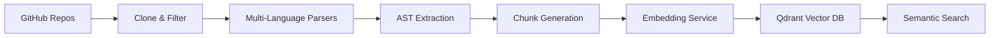

# Code Ingestion System

[](https://www.python.org/downloads/)
[](https://modal.com)
[](https://opensource.org/licenses/MIT)

**Multi-Language Vector Database Pipeline** - A comprehensive system for ingesting, parsing, and vectorizing code repositories into searchable vector databases.

## 🎯 What is This?

A production-ready code ingestion pipeline that:
- **Clones** GitHub repositories
- **Parses** multi-language codebases (Rust, TypeScript, Solidity, Documentation)
- **Embeds** code chunks using state-of-the-art embedding models
- **Stores** vectors in Qdrant for semantic search
- **Monitors** ingestion quality and performance

### Key Features

- **📂 Multi-Repository Support** - Clone and ingest multiple repos with priority-based processing
- **🔍 Multi-Language Parsing** - AST-based parsing for Rust, TypeScript, Solidity, and Markdown
- **🧠 Semantic Embeddings** - Qwen3-Embedding-8B (4096D) via Cloudflare AI Gateway or Modal
- **💾 Vector Storage** - Qdrant vector database with language-specific collections
- **🔎 Cross-Language Search** - Semantic search across all ingested codebases
- **📊 Comprehensive Monitoring** - Statistics, health checks, and quality validation
- **🔄 Checkpoint Resume** - Resume interrupted ingestion from last successful state
- **⚡ Batch Processing** - Concurrent embedding generation with rate limiting

## 🚀 Quick Start

### Prerequisites

- Python 3.11+
- [uv](https://github.com/astral-sh/uv) (installed automatically if missing)
- Qdrant Vector Database (local or cloud)
- Embedding service (Cloudflare AI Gateway + DeepInfra OR Modal)
- GitHub Personal Access Token (for private repos)

### Installation

```bash
# Clone the repository
git clone git@github.com:ardaglobal/i2p.git
cd i2p

# Complete setup with virtual environment (uv-based)
make setup

# Or step-by-step:
make venv      # Create virtual environment
make install   # Install dependencies

# Set up environment variables
cp .env.example .env
# Edit .env with your credentials:
# QDRANT_URL=your_qdrant_url
# QDRANT_API_KEY=your_qdrant_key
# CLOUDFLARE_AI_GATEWAY_TOKEN=your_token
# DEEPINFRA_API_KEY=your_key
# GITHUB_TOKEN=your_pat_token

# Activate virtual environment
source .venv/bin/activate

# Verify setup
make check-env
```

### Basic Usage

```bash
# Ingest repositories
make ingest

# Test vector search
make ingest-search QUERY='authentication service'

# Check system health
make health

# View vector database statistics
make vector-status
```

## 📁 Project Structure

```
i2p/
├── 📖 Makefile                  # Comprehensive command interface
├── 📝 CLAUDE.md                 # Development guidelines & best practices
├──
├── modules/
│   └── ingest/                  # Ingestion pipeline
│       ├── core/
│       │   ├── 🔄 pipeline.py        # Multi-language ingestion orchestrator
│       │   ├── ⚙️ config.py          # Repository and ingestion configuration
│       │   ├── 🔗 embedding_service.py # Embedding generation (Modal/Cloudflare)
│       │   ├── 📦 batch_processor.py  # Concurrent batch processing
│       │   ├── 💾 storage_manager.py  # Vector storage management
│       │   ├── ✅ checkpoint_manager.py # Resume from interruption
│       │   ├── 📋 file_processor.py   # File parsing coordination
│       │   └── 📊 metadata_schema.py  # Vector metadata structure
│       ├── parsers/
│       │   ├── 🦀 rust_parser.py         # Rust code AST parsing
│       │   ├── 📘 typescript_parser.py   # TypeScript/JSX parsing
│       │   ├── ⚡ solidity_parser.py     # Solidity contract parsing
│       │   ├── 📄 documentation_parser.py # Markdown documentation
│       │   ├── 🐍 yaml_parser.py         # YAML configuration files
│       │   └── 🏗️ terraform_parser.py   # Terraform infrastructure
│       ├── services/
│       │   ├── 🔗 vector_client.py       # Qdrant database client
│       │   ├── 🚀 tei_service.py         # TEI embedding service (Modal L4 GPU)
│       │   ├── 🤖 modal_client.py        # Modal service client wrapper
│       │   ├── 🔍 enhanced_ranking.py    # Advanced search ranking
│       │   └── ✅ quality_validator.py   # Code quality validation
│       ├── scripts/
│       │   ├── 🔄 repo_cloner.py         # GitHub repository cloning
│       │   ├── 🗂️ collection_manager.py  # Qdrant collection management
│       │   ├── 📊 stats_reporter.py      # Statistics and reporting
│       │   ├── 📝 repo_metadata.py       # Repository metadata capture
│       │   └── 🔍 search_test.py         # Vector search testing
│       └── deploy/
│           └── 🚀 modal_deploy.py    # Modal deployment orchestrator
│
└── repos/                       # Cloned repositories (gitignored)
    ├── arda-credit/             # Rust blockchain infrastructure
    ├── arda-platform/           # TypeScript monorepo
    └── ...                      # Additional configured repositories
```

## 🛠️ Available Commands

### 🏗️ Setup & Installation
```bash
make venv             # Create virtual environment using uv
make install          # Install Python dependencies
make sync             # Sync dependencies with uv (faster)
make setup            # Complete system setup (venv + install + check-env)
make check-env        # Verify environment variables
```

### 🗄️ Vector Database & Ingestion
```bash
make ingest           # Full ingestion pipeline (all languages)
make ingest-warmup    # Warm up embedding service before ingestion
make ingest-search QUERY='text'  # Test vector search functionality
make vector-status    # Check Qdrant collections and vector counts
make index-check      # Check vector indexing progress
```

### 📦 Repository Management
```bash
make clone-repos      # Clone high-priority repos only (~10 repos)
make clone-repos-medium  # Clone medium+high priority repos (~16 repos)
make clone-repos-all  # Clone ALL configured repositories
make collection-cleanup   # Clean/recreate all vector collections
make collection-status    # Get detailed collection statistics
make repo-metadata        # Capture repository commit metadata
make stats-report         # Generate comprehensive statistics report
```

### 🚀 Modal & Embedding Services
```bash
make modal-deploy     # Deploy Qwen3-Embedding-8B to Modal (L4 GPU)
make modal-health     # Check Modal embedding service health
make modal-monitor    # Monitor GPU distribution
```

### ⚙️ System Management
```bash
make health           # System health check (ingestion + vector search)
make test             # Run all tests
make clean            # Clean up generated files and caches
```

## 🏗️ Architecture

### Ingestion Pipeline Flow



### Components

1. **📂 Repository Manager** - Clones and manages GitHub repositories with priority-based selection
2. **🔍 Language Parsers** - AST-based parsing for Rust, TypeScript, Solidity, Documentation
3. **🧠 Embedding Service** - State-of-the-art embeddings (Qwen3-Embedding-8B, 4096D)
4. **💾 Vector Storage** - Qdrant database with language-specific collections
5. **🔎 Search Engine** - Cross-language semantic search with enhanced ranking
6. **📊 Monitoring** - Health checks, statistics, and quality validation

### Supported Languages & Content Types

- **🦀 Rust** - Complete parsing including macros, traits, async code, and implementations
- **📘 TypeScript** - React components, hooks, utilities, type definitions, and interfaces
- **⚡ Solidity** - Smart contracts, interfaces, events, and deployment scripts
- **📚 Documentation** - Markdown files, knowledge bases (Obsidian), technical documentation
- **🐍 YAML** - Configuration files, CI/CD pipelines, Kubernetes manifests
- **🏗️ Terraform** - Infrastructure as code, resource definitions, modules

## 🔧 Configuration

### Environment Variables

```env
# Required
QDRANT_URL=https://your-qdrant-instance.qdrant.io
QDRANT_API_KEY=your_qdrant_api_key

# Embedding Service (Option 1: Cloudflare AI Gateway)
CLOUDFLARE_AI_GATEWAY_TOKEN=your_cloudflare_token
DEEPINFRA_API_KEY=your_deepinfra_key

# Embedding Service (Option 2: Modal)
MODAL_TOKEN_ID=your_modal_token_id
MODAL_TOKEN_SECRET=your_modal_token_secret

# Repository Cloning
GITHUB_TOKEN=your_github_pat_token
```

### Repository Configuration

Edit `modules/ingest/core/config.py` to configure repositories:

```python
REPOSITORIES = {
    "arda-credit": RepoConfig(
        github_url="https://github.com/ardaglobal/arda-credit",
        priority="high",
        languages=["rust"],
        components=["api", "program", "contracts"]
    ),
    # ... add more repositories
}
```

### Vector Database Collections

- **Code Collections**: `rust`, `typescript`, `solidity` (language-specific)
- **Documentation Collection**: `documentation` (knowledge bases, technical docs)
- **Embedding Model**: Qwen3-Embedding-8B (4096 dimensions)
- **Chunk Size**: 500 tokens with 50 token overlap (code), 6k-12k chars (documentation)
- **Score Threshold**: 0.3 (cosine similarity)

## 🔍 Vector Search Features

### Enhanced Ranking
- **Semantic similarity** using cosine distance
- **File type relevance** boosting
- **Recency scoring** for recently modified files
- **Language-specific** collection searching

### Quality Validation
- **Syntax verification** for all ingested code
- **Content filtering** removing comments and empty files
- **Deduplication** by chunk hash preventing redundant storage
- **Error handling** with graceful fallbacks

### Search Examples

```bash
# Search for authentication code
make ingest-search QUERY='authentication service'

# Search for specific patterns
make ingest-search QUERY='JWT token validation'

# Search across all languages
make ingest-search QUERY='database connection pool'
```

## 📊 Performance & Monitoring

### System Health Checks
```bash
make health         # Pipeline status & connectivity
make vector-status  # Detailed vector database metrics
make stats-report   # Comprehensive ingestion statistics
```

### Key Metrics
- **Vector Collections**: 50K+ code chunks across all collections
- **Search Latency**: <200ms for semantic queries
- **Embedding Generation**: ~45 embeddings/sec via Modal TEI (L4 GPU)
- **Ingestion Throughput**: Varies by repo size and language complexity
- **Documentation Chunks**: Intelligent section grouping (6k-12k chars per chunk)

### Monitoring Features
- Real-time ingestion progress tracking
- Collection-level statistics (points, indexed vectors, memory usage)
- Per-repository ingestion metrics
- Embedding service health checks
- Checkpoint-based resume capability

## 🎯 Use Cases

### For Development Teams
- **Code Search** - Semantic search across all codebases
- **Documentation Discovery** - Find relevant technical documentation
- **Cross-Repository Analysis** - Understand patterns across multiple repos
- **Knowledge Base** - Searchable organizational knowledge

### For AI Systems
- **Context Retrieval** - Retrieve relevant code for AI agent tasks
- **Code Understanding** - Multi-language semantic code comprehension
- **Documentation Access** - Access to organizational knowledge bases
- **Pattern Discovery** - Find implementation patterns and examples

## 🛡️ Security & Best Practices

### Code Quality Guidelines
- Files must be under 500 lines (strict enforcement)
- Single responsibility principle for all classes
- Comprehensive error handling and validation
- Security-first approach with no exposed secrets

### Development Standards
- **OOP-First Design** - Every functionality in dedicated classes
- **Modular Architecture** - Lego-like component composition
- **Checkpoint System** - Resume capability for long-running ingestion
- **Batch Processing** - Efficient concurrent embedding generation

### Pipeline Behavior

#### Collection Strategy
- **Language-Specific Collections**: Each language has its own collection for better relevance
- **Documentation Separation**: Documentation is stored separately to prevent code pattern contamination
- **Metadata Enrichment**: Each chunk includes repository, file path, language, and commit metadata

#### Error Handling
- **Graceful Degradation**: Failed files don't stop the entire ingestion
- **Retry Logic**: Automatic retry for transient embedding service failures
- **Checkpoint Resume**: Resume from last successful state after interruption

## 🤝 Contributing

1. Follow the guidelines in `CLAUDE.md`
2. Ensure all files remain under 500 lines
3. Use single responsibility principle
4. Add comprehensive tests for new features
5. Maintain security best practices

## 📚 Documentation

- **[`docs/`](./docs/README.md)** - Complete technical documentation
- **[`docs/modules/ingest/PIPELINE.md`](./docs/modules/ingest/PIPELINE.md)** - Ingestion pipeline details
- **[`docs/modules/ingest/PARSERS.md`](./docs/modules/ingest/PARSERS.md)** - Language parser documentation
- **[`CLAUDE.md`](./CLAUDE.md)** - Development guidelines and coding standards
- **[`Makefile`](./Makefile)** - Complete command reference with examples

## 🔗 Related Projects

- **Arda Credit** - Privacy-preserving credit infrastructure (Rust)
- **Arda Platform** - Monorepo with Platform, Credit App, and IDR (TypeScript)
- **Arda Knowledge Hub** - Organizational knowledge base and documentation (Markdown/Obsidian)
- **Modal Platform** - Serverless GPU infrastructure for embeddings
- **Qdrant** - Vector database for semantic search

## 📄 License

MIT License - see `LICENSE` file for details.

---

**Code Ingestion System** - Transforming code repositories into searchable vector databases with multi-language support and semantic search.
